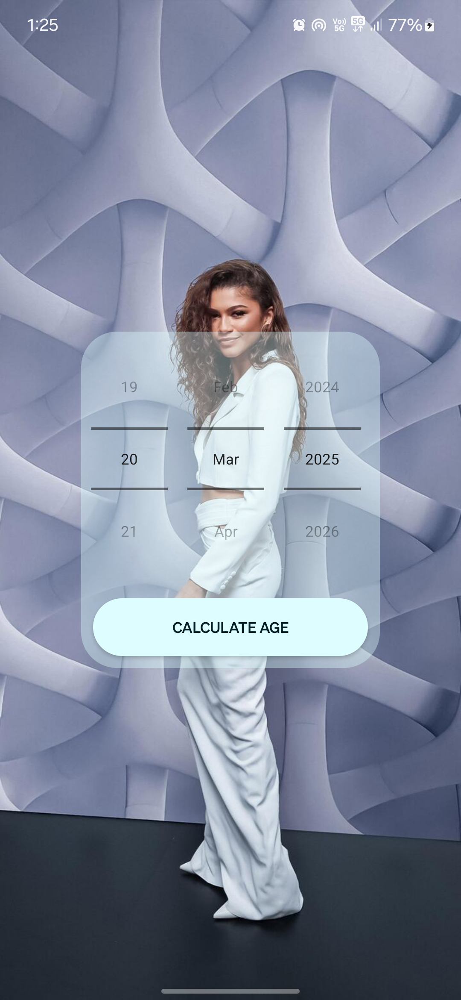
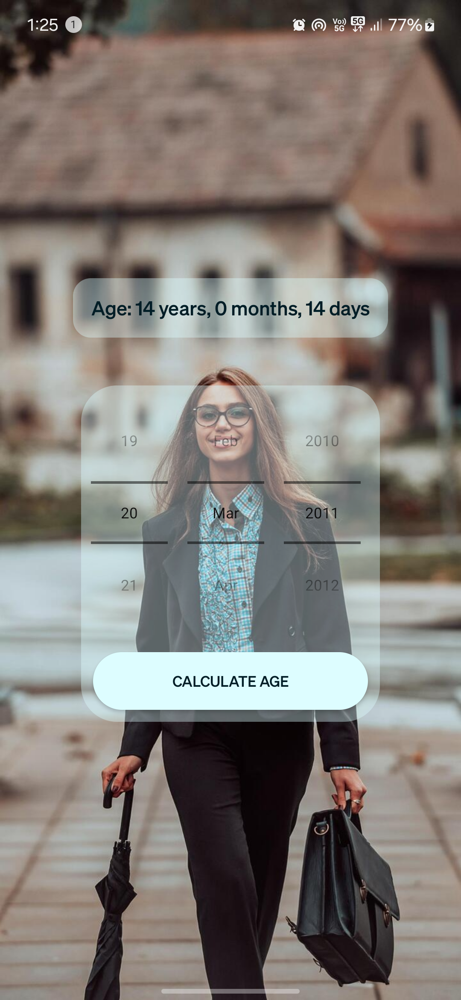

# 📱 Age Checker App

The **Age Checker App** is a simple, fast, and highly optimized Android application that calculates your exact age in **years**, **months**, and **days** based on your Date of Birth (DOB). Designed for smooth performance across all Android devices, this app runs offline and offers an attractive black & white theme.

---

## ✨ Features
- ✅ Clean and user-friendly interface
- ✅ Accurate age calculation (Years, Months, Days)
- ✅ Lightweight and fully optimized for Android
- ✅ No internet connection required (Offline)
- ✅ Elegant black & white theme for better readability
- ✅ Supports all screen sizes

---

## 📸 Screenshots

### 🏠 Home Screen

### 📊 Result Screen

---

## 🚀 How to Use
1. Open the **Age Checker App**
2. Select your **Date of Birth**
3. Tap on **Check Age**
4. Get your exact age instantly

---

## 🛠 Tech Stack
- **Language:** Java
- **UI Design:** XML
- **IDE:** Android Studio
- **Minimum SDK:** Android 5.0 (Lollipop)

---

## 📥 Download APK
👉 [Download Latest APK](https://your-apk-download-link)

---

## 📚 License
This project is licensed under the **MIT License**  
✅ Free for personal and educational use

---
